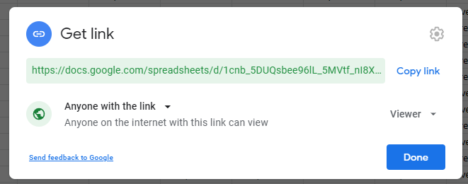
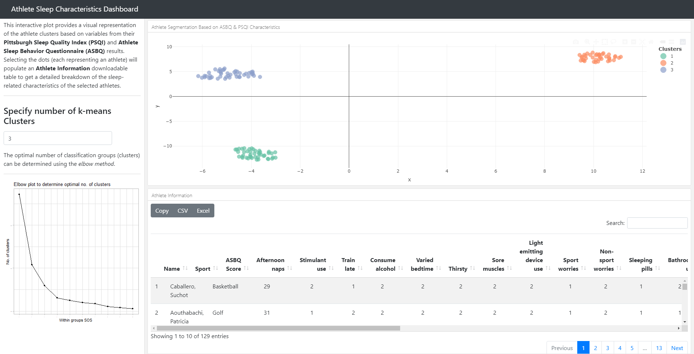

<!-- badges: start -->
  [](https://opensource.org/licenses/MIT)
  [](https://www.tidyverse.org/lifecycle/#experimental)
  <!-- badges: end -->

# AthSlpBehaviouR 

`AthSlpBehaviouR` is intended to retrieve, clean and visualize Athlete Sleep Behaviour Questionnaire (ASBQ) and Pittsburgh Sleep Quality Index (PSQI) data collected on Google Sheets, through a Google Form template.

## Installation - Latest Development Version from Github

```{r}
#Install the development version from GitHub  
install.packages("devtools")
devtools::install_github("hareshsuppiah/athslpbehaviour")
```

## Load package
```{r}
library(athslpbehaviour)
```

# Usage

`AthSlpBehaviouR` currently has two main functions - cleaning and scoring ASBQ and PSQI data, as well as creating a Shiny dashboard to aid practitioners in categorising athlete sleep characteristics and behaviours using a k-means cluster analysis. The data is collected using a standard Google Forms template (see below), which is eventually stored onto a Google Sheet.

* `clean_sheet_data()`
* `create_dashboard()`

#### ASBQ-PSQI Google Form Questionnaire Template

A Google Form template for use with `AthSlpBehaviouR` can be downloaded [here](https://docs.google.com/forms/d/16T_0vbpiZdNipz14kSZiGCrqVgSQ3ULNbIxYYZg0y90/template/preview). **‼Note:** `AthSlpBehaviouR` will currently only work with this template.

#### Pseudo ASBQ-PSQI data

Pseudo data can be used to try the functions within `AthSlpBehaviouR` [here](https://docs.google.com/spreadsheets/d/1cnb_5DUQsbee96lL_5MVtf_nI8XmJqKmYQKFP9_INJY/edit?usp=sharing) 

## Clean and score ASBQ and PSQI data - clean_sheet_data():

To clean and score PSQI and ASBQ data collected from a Google Form (and stored in a Google Sheet) use:

```
clean_sheet_data(urlstring="https://docs.google.com/spreadsheets/d/1cnb_5DUQsbee96lL_5MVtf_nI8XmJqKmYQKFP9_INJY/edit?usp=sharing")              
```
The `clean_sheet_data()` function accepts 1 argument:

* **urlstring**: A url for the (shared) Google Sheet containing data using the ASBQ-PSQI Google Form template.

The url from the Google Sheet can be obtained using the **Share** option and copying the url link of the sheet.



The function returns a csv file **`asbq_psqi_df.csv`** in an `output` folder within the working directory.

## Create Shiny Dashboard - create_dashboard():

To create a Shiny dashboard app to aid in the categorisation and visualisation of different sleep characteristics and behaviours use:

```
create_dashboard(urlstring="https://docs.google.com/spreadsheets/d/1cnb_5DUQsbee96lL_5MVtf_nI8XmJqKmYQKFP9_INJY/edit?usp=sharing")             
```
The `create_dashboard()` function accepts 1 argument:

* **urlstring**: A url for the (shared) Google Sheet containing data using the ASBQ-PSQI Google Form template.

The function creates an interactive Shiny Flexdashboard that helps categorise the sleep characteristics and behaviours of athletes using a k-means cluster analysis.



# Future development

`AthSlpBehaviouR` is still under development and may change over time. Here is a brief roadmap and future updates:

- [x] ASBQ and PSQI data cleaning function // *clean_sheet_data()*
- [x] Interactive Shiny Dashboard to visualise and categorise athlete sleep based on ASBQ and PSQI data // *create_dashboard()*
- [ ] ASBQ-only data cleaning function
- [ ] PSQI-only data cleaning function
- [ ] Sleep habit intervention recommendations system based on clustering
